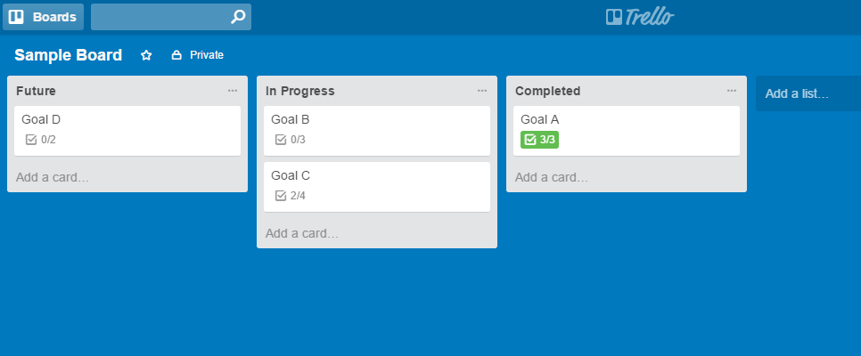

# Trello Emailer

This is a simple Python script that sends an email with the first incomplete item in every checklist for each card in a Trello list.

## Getting Started


### Prerequisites

I chose to use [py-trello](https://github.com/sarumont/py-trello) instead of [trello](https://pypi.python.org/pypi/trello) for Python 3+.

This script uses Gmail by SMTP, which requires access to Gmail.  Gmail restricts regular username/password access to SMTP as a "Less secure app," and I've found two ways to work around this:
* Allowing access to less secure apps
* Setting a custom password for this app

I chose the latter, but the first should work as well.


### Installing

Install py-trello

```
pip install py-trello
```
Install pytest for testing
```
pip install pytest
```
Set the following session variables from your [Trello API credentials](https://trello.com/1/appKey/generate)

* TRELLO_API_KEY
* TRELLO_API_SECRET
* TRELLO_EXPIRATION is optional. Set it to a string such as 'never' or '1day'. Trello's default OAuth Token expiration is 30 days.

Once those session variables are set, run the following to get your token and token_secret:

```
python ./trello/util.py
```

Create a user_config.py file that includes your API information, Trello board ids, and email information.  It's included in the .gitignore. It should look like the following:

```
TRELLO_API_INFO = {
    'api_key': YOUR_API_KEY,
    'api_secret': YOUR_API_SECRET,
    'token': YOUR_TOKEN,
    'token_secret': YOUR_TOKEN_SECRET
}

BOARDS_TO_WATCH = ['BOARD_ID']

EMAIL_INFO = {
    'address': YOUR_EMAIL,
    'password': YOUR_EMAIL_PASSWORD
} 
```

My Trello setup for the board I'm keeping track of looks like this:



The script accesses all cards in the 2nd list ("In Progress") in emailer.py, and I've noted the line with a comment if you need to change to a different card.

You can run the program by the following:

```
python emailer/emailer.py
```

Here is the sample email using the example above:
```
Subject: Trello Tasks for Today

Goal B
    Checklist Name
        Item 1
Goal C
    Checklist Name
        Item 3
```

I added a crontab that will run emailer.py every morning at 8:00 AM.  

```

PATH=/usr/local/bin/

0 8 * * * python3 /PATH/TO/emailer/emailer.py
```

## License

This project is licensed under the MIT License

## Acknowledgments

* Thanks to [sarumont](https://github.com/sarumont) for [py-trello](https://github.com/sarumont/py-trello) 
